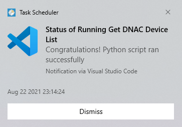
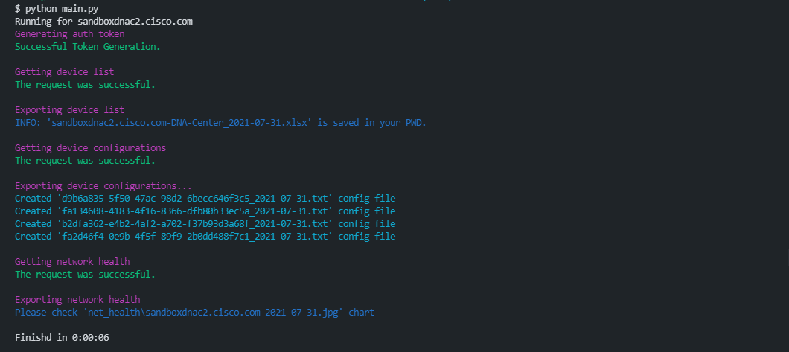
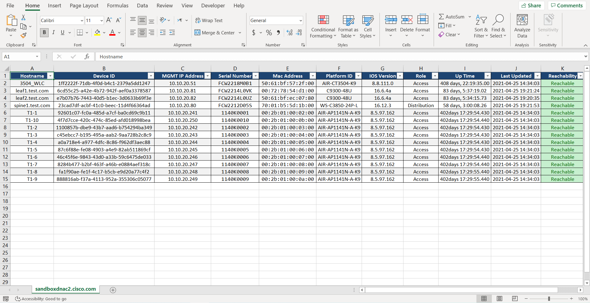
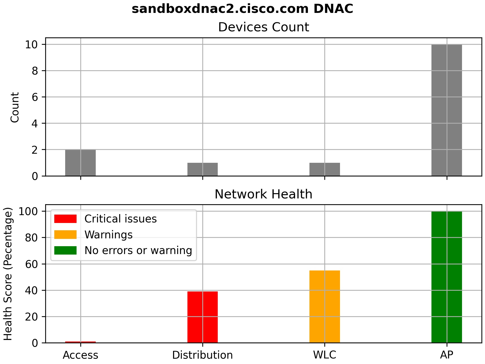

[](https://developer.cisco.com/codeexchange/github/repo/Tes3awy/Cisco-DNA-Center-Device-List)
[](https://www.python.org/downloads)

[](https://github.com/Tes3awy/Cisco-DNA-Center-Device-List/issues)
[](https://github.com/Tes3awy/Cisco-DNA-Center-Device-List/commits/main)

[](https://github.com/Tes3awy/Cisco-DNA-Center-Device-List)
[](https://github.com/Tes3awy/Cisco-DNA-Center-Device-List/blob/main/CONTRIBUTING.md)
[](https://github.com/Tes3awy/Cisco-DNA-Center-Device-List)
[](https://github.com/psf/black)
[](https://pycqa.github.io/isort/)
[](https://github.com/pre-commit/pre-commit)

# Cisco DNA Center Device List, Device Config, and Network Health

This program is designed to export a Cisco DNAC device list and save them to an Excel sheet, device configurations and save them to text file, and network health and generate a bar chart.

## Table of Contents

1. [Installation](#installation)
2. [Getting Started](#getting-started)
3. [Usage](#usage)
4. [Collected Data from Device List Response](#collected-data)
5. [Use it for your DNA Center](#use-it-for-your-dna-center)
6. [References](#references)
7. [Previews](#previews)

### Installation

```bash
$ git clone https://github.com/Tes3awy/Cisco-DNA-Center-Device-List.git
$ cd Cisco-DNA-Center-Device-List
$ pip install -r requirements.txt --user
```

### Getting Started

```bash
│   main.py
│   get_auth_token.py
│   get_device_list.py
│   get_device_config.py
│   get_network_health.py
│   export_device_list.py
│   export_device_config.py
│   export_network_health.py
│   notify.py
│   .env.example
│   requirements.txt
│   README.md
│   CONTRIBUTING.md
│   CODE_OF_CONDUCT.md
│   .pre-commit-config.yaml
│   .gitignore
│   LICENSE
│
├───.github
│   └───ISSUE_TEMPLATE
│           bug_report.md
│           feature_request.md
│
└───assets
        preview.png
        sandboxdnac2.cisco.com.jpg
        script-logs.png
```

### Usage

You need to provide your Cisco DNA Center credentials in a `.env` file. Create a `.env` file from `.env.example` and **DON'T** delete the latter (Check **Use it for your DNA Center** section).

> **A `.env` file in the current working directory will override the `.env.example` values.**

**Then run:**

```python
python main.py
```

Voila :sparkles:! An Excel file is created automatically from the device list on Cisco DNAC in the current working directory, configuration files of those devices are created in `configs/<DOMAIN>/<today>/<config_id>_<today>.txt`, and a network health diagram **(a bar chart with a legend)** is created in `net_health/<BASE_URL>-<today>.jpg`.

> Unlike handling text files, `XlsxWriter` library does not have the option of appending new data to an existing Excel file. So every time you run the script, the Excel file will be overwritten.

> **NOTE:** You have to close the Excel program before re-running the script.

**For Windows Users ONLY**

You will be notified with a native toast notification upon script successful completion.


### Collected Data from Device List Response

1. Hostname
2. Device ID
3. Management IP Address
4. Serial Number
5. Mac Address
6. Platform ID _(Device Model)_
7. Software Version
8. Role
9. Up Time
10. Last Update
11. Reachability Status

### Use it for your DNA Center

This program is ready to be used for your deployed Cisco DNA Center.

**Create a `.env` file from `.env.example`:**

```bash
$ cp .env.example .env
```

Repalce the `.env` file values with your Cisco DNA Center credentials.

**Example:**

`.env`

```vim
DOMAIN=10.10.1.1 # without a trailing slash (/)
PORT=443
BASE_URL=https://${DOMAIN}:${PORT}
USERNAME=root
PASSWORD=C1sco12345
SSL_CERTIFICATE=False  # set to True ONLY if you have a valid SSL certificate
```

### References

**API Endpoints**

[DNA Center Platform](https://developer.cisco.com/docs/dna-center/#!authentication-api)

**Documentation**

[Cisco DNA Assurance User Guide](https://www.cisco.com/c/en/us/td/docs/cloud-systems-management/network-automation-and-management/dna-center-assurance/1-3/b_cisco_dna_assurance_1_3_ug/b_cisco_dna_assurance_1_3_ug_chapter_0101.html#task_rn2_zdr_yy__p_assurance_score)

### Previews

**_Script Logs_**


**_Excel File Preview_**


**_A demonstration for color formatting_**

